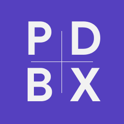

<div style="flex-direction: column; align-items: center">

Passblock DataBase eXtension
</div>

A robust Dart library for managing encrypted databases in the **PDBX** format. Designed for secure storage of passwords, notes, and other sensitive records with group support.

---

## 🔎 File Format Specification

The PDBX format is a custom binary structure optimized for security, atomicity, and sequential access.

| Field            | Type       | Offset     | Size | Description                                |
| ---------------- | ---------- | ---------- | ---- | ------------------------------------------ |
| **magic**        | uint32     | 0x00       | 4B   | Constant `0x70646278` (`pdbx`)             |
| **version**      | uint16     | 0x04       | 2B   | Format version (Little Endian)             |
| **index_length** | uint32     | 0x06       | 4B   | Size of encrypted index block              |
| **salt**         | byte\[16\] | 0x0A       | 16B  | Random salt for Argon2id KDF               |
| **index_iv**     | byte\[12\] | 0x1A       | 12B  | IV for index decryption                    |
| **index_block**  | byte\[\]   | 0x26       | var  | Encrypted JSON list of groups and pointers |
| **entry_blocks** | byte\[\]   | 0x26 + var | var  | Sequential encrypted `PdbxEntry` blocks    |

---

## 🚀 Key Features

- **Binary I/O Layer**: Low-level file manipulation via `BinaryReader` and `BinaryWriter` with atomic write support.
- **Security First**: Key derivation using **Argon2id** and authenticated encryption via **AES-256-GCM** (`CryptoService`).
- **Structured Models**: Fully serializable models: `PdbxEntry`, `PdbxGroup`, `PdbxIndex`, and `PdbxEntryPointer`.
- **Vault Management (`PdbxManager`)**:
  - Initialize and destroy storage files.
  - Secure session management (Lock/Unlock).
  - Full CRUD operations with lazy loading (fetch details only when needed).
  - **Automatic Index Stabilization**: Recalculates offsets during save/delete to ensure data integrity.

---

## 📁 Installation

Add `pdbx` to your `pubspec.yaml`:

```yaml
dependencies:
  pdbx: ^1.0.0
```

> Note: If you modify models, ensure you run `dart run build_runner build` to generate JSON serialization code.

---

## 🛠️ Usage Example

See [pdbx_example.dart](example/pdbx_example.dart).

---

## 🏗️ Architecture

1. **Binary Layer**: Handles byte-level file access and ensures offsets are correctly managed.
2. **Crypto Layer**: Manages key stretching (Argon2id) and encryption/decryption (AES-GCM).
3. **Data Models**: Defines the JSON schema for indices and entries.
4. **Manager (Facade)**: The high-level API that coordinates state, synchronization, and storage lifecycle.

---

## 📝 Changelog

See [CHANGELOG](CHANGELOG.md).
